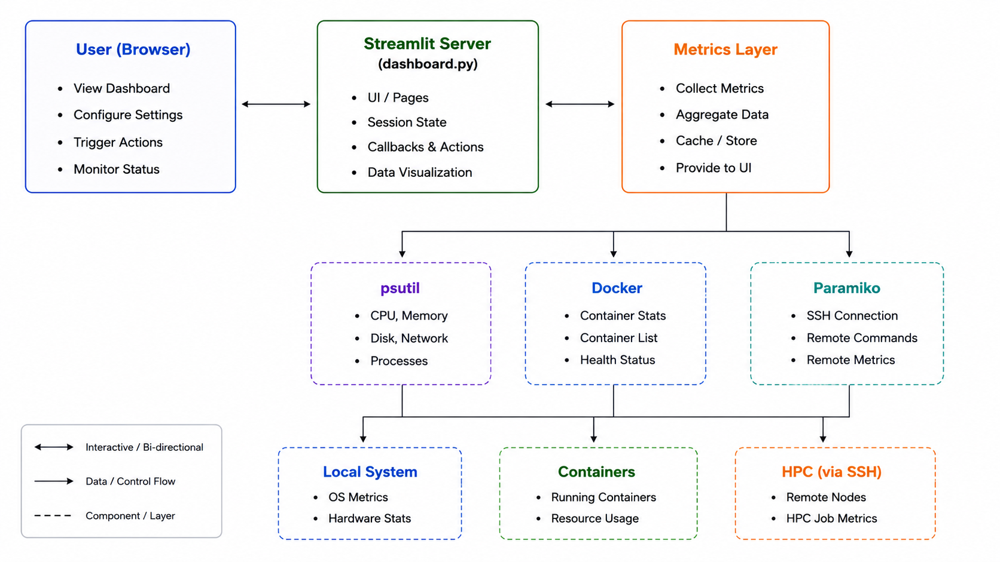
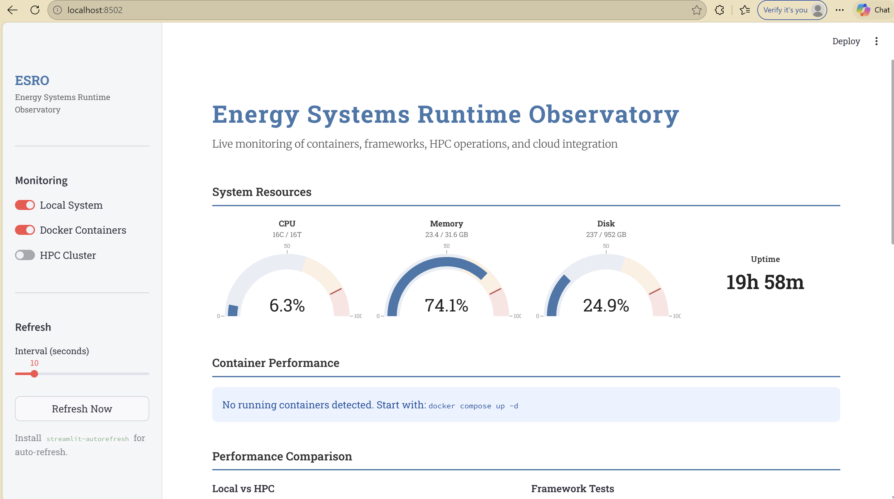
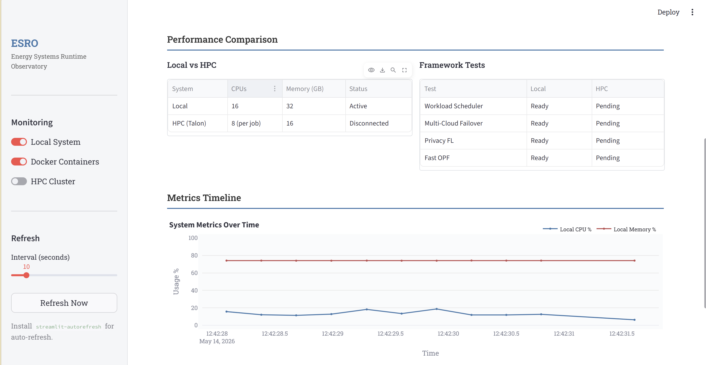

<div align="center">
   
</div>

# Energy Systems Runtime Observatory


A real-time monitor of local system resources, Docker containers, HPC jobs, and cloud integration.


## Features

- Live system and container metrics (CPU, memory, disk, Docker)
- HPC job monitoring via SSH (SLURM)
- Extensible for cloud and framework integration

<div align="center">
   
   <br><b>Figure 1:</b> ESRO Architecture Flow
</div>

## Requirements

* Python 3.8+
* The following Python packages (see requirements.txt):
  - streamlit
  - pandas
  - plotly
  - psutil
  - paramiko
* Docker (for container monitoring, optional)


## Setup

1. Clone this repository or copy the folder.
2. Install dependencies:
   ```bash
   pip install -r requirements.txt
   ```
3. Run the dashboard using Streamlit:
   ```bash
   streamlit run dashboard.py
   ```

   <div align="center">

   
   <br><b>Figure 2:</b> ESRO Dashboard Display
</div>

## Usage


* Open the dashboard in your browser (Streamlit will provide a local URL).
* Use the sidebar to enable local system monitoring or connect to an HPC cluster.
* For HPC jobs, enter your SSH credentials in the sidebar or use the example config below.


<div align="center">
   
   <br><b>Figure 3:</b> ESRO Metrics Timeline Example
</div>

### Example HPC Config

You can use the following JSON structure for reference (see example_hpc_config.json):

```
{
    "host": "talon.und.edu",
    "username": "your_username",
    "password": "your_password"
}
```

## Folder Structure

- `dashboard.py` — Main Streamlit app
- `requirements.txt` — Python dependencies
- `README.md` — This file
- `modules/` — (Optional) For future extensions
- `data/` — (Optional) For logs or data

## Notes

- Always run the dashboard with `streamlit run dashboard.py` (not `python dashboard.py`).
- Docker is only required if you want to monitor containers.
- For HPC monitoring, your credentials are only used for the session and not stored.
